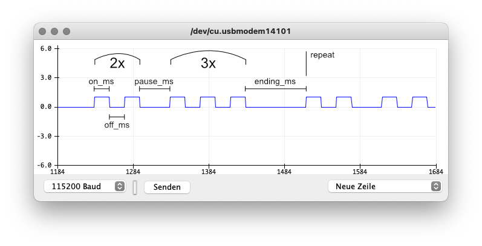
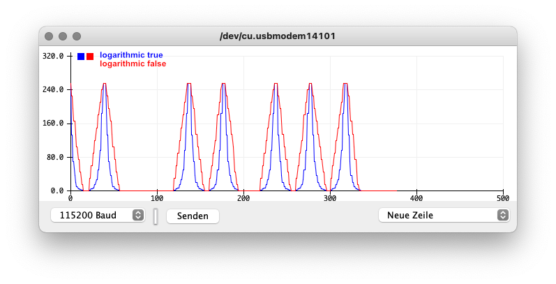

# Arduino-Blinkenlight

[](https://github.com/tfeldmann/Arduino-Blinkenlight/actions/workflows/tests.yml)

Featured on [hackster.io](https://www.hackster.io/news/thomas-feldmann-s-arduino-blinkenlight-brings-you-smooth-non-blocking-status-led-flashing-and-fading-1d533e3cd20c)!

## 🚨 Supercharge your status-LEDs 🚨

> This library gives you non-blocking blinking patterns and smooth fade effects for your
> LEDs, buzzers or any other status indicators

<pre align="center">
<strong>Achtung Alles Lookenskeepers!</strong>
Das computermachine ist nicht fuer gefingerpoken und
mittengrabben. Ist easy schnappen der springenwerk,
blowenfusen und poppencorken mit spitzensparken. Ist nicht
fuer gewerken bei das dumpkopfen. Das rubbernecken
sichtseeren keepen das cotten-pickenen hans in das pockets
muss; <i>relaxen und watchen das blinkenlichten.</i>
</pre>

## Features

- On / off / toggle
- Infinite blinking
- Blink patterns (for example to blink an error code)
- Single flashes and pauses, resuming the previous mode

Other goodies:

- Completely non-blocking (no `delay()`)
- Super-nice fading effects (optional) with logarithmic brightness compensation for LEDs
- Lightweight
- All parameters can be adjusted on the fly without visual hickups
- Easily extendable to control components via SPI / CAN / I2C / UART ...
- Comes with good-looking defaults (at least I tried)
- Tries to be user friendly (for example calling `blink()` while blinking does not
  restart the cycle)
- Supports active low (inverted) logic
- Can be used for buzzers as well

## Example

This example blinks the built-in LED on pin 13 in the following pattern:



```C
#include <Fadinglight.h>

Fadinglight led(13);

void setup()
{
    led.pattern(2, 3);  // blink 2x, then 3x
}

void loop()
{
    led.update();
}
```

Easy, uh? It's not only blinking, it does so with smooth fading effects and
logarithmic LED brightness compensation. Your boards never looked more professional! /s

> Note: If you don't love the fading effects, just use the `Blinkenlight`-class instead
> of `Fadinglight`.

## Installation

`Blinkenlight` is available in the Arduino library manager and on [`platform.io`](https://platformio.org/lib/show/13287/Blinkenlight):

```
pio lib install "tfeldmann/Blinkenlight"
```

## Full API

### Instantiation

```C
// Without fading effect:
#include <Blinkenlight.h>
Blinkenlight myLed(13);

// With fading effect:
#include <Fadinglight.h>
Fadinglight myLed(13);

// now in your code you can do:
myLed.off();
myLed.blink();
// ... and so on (see below)

// options available in the constructor:
Blinkenlight(int pin, bool invert = false);
Fadinglight(int pin, bool logarithmic = true, int fade_speed = 30);
```

### Basic usage (what you can do with your light)

```C
// set permanently ON
void on();

// set permanently OFF
void off();

// toggle between on / off
void toggle();

// set ON / OFF permanently
void permanent(bool enable);

// blink infinitely
void blink();

// blink `num` times, then long pause
// repeats, if `repeat` is set, OFF otherwise.
void pattern(int num, bool repeat = true);

// same as before, but accepts a speed setting
void pattern(int num, SpeedSetting speed, bool repeat = true);

// blink `num1` times, short pause, blink `num2` times, long pause
// repeats, if `repeat` is set, OFF otherwise.
void pattern(int num1, int num2, bool repeat = true);

// same as before, but accepts a speed setting
void pattern(int num1, int num2, SpeedSetting speed, bool repeat = true);

// turn ON for the given duration in ms. Continues in the previous mode afterwards.
void flash(uint16_t duration_ms);

// turn OFF for the given duration in ms. Continues in the previous mode afterwards.
void pause(uint16_t duration_ms);

// `true` if the Blinkenlight is currently blinking, showing a pattern, flashing or pausing
bool isOn();

// You must call this in your loop!
// Returns the current value of the light (LOW / HIGH).
// - You can ignore that if you want.
int update();
```

### Blinking speed and timing parameters

```C
// setup the timing parameters
void setSpeed(SpeedSetting setting);

// Available by default: SPEED_RAPID, SPEED_FAST, SPEED_SLOW
myLed.setSpeed(SPEED_RAPID);
myLed.setSpeed(SPEED_FAST);
myLed.setSpeed(SPEED_SLOW);

// .. or use your own settings. SpeedSetting is a struct:
typedef struct
{
    uint16_t on_ms;         // ON time in milliseconds
    uint16_t off_ms;        // OFF time in milliseconds
    uint16_t pause_ms;      // pause between `num1` and `num2` in pattern()
    uint16_t ending_ms;     // ending after a full pattern
} SpeedSetting;

// so you can set it up like this:

SpeedSetting mySettings = {
    .on_ms = 100,
    .off_ms = 100,
    .pause_ms = 2000,
    .ending_ms = 2000,
};

// ... alternatively you can setup the speed settings directly with this method
void setSpeed(
    uint16_t on_ms,
    uint16_t off_ms,
    uint16_t pause_ms,
    uint16_t ending_ms);

// ... or by providing a single value, the other values are inferred from that by
// some internal factors
void setSpeed(uint16_t on_ms);

// Hint: You can also modify the values directly - even on the fly - e.g.:
myLed.settings.on_ms = 250;
myLed.settings.pause_ms = 2000;
```

## Fading effect and brightness compensation

LED brightness is not linear to the PWM value you set to the pin.
This library uses a logarithmic dimming curve to create natural looking fading effects.



## I have a status indicator controlled via CAN / I2C / SPI / ... What can I do?

No problem! You have two options.

- Use the generic `BaseBlinker` class from `<BaseBlinker.h>`. The `.update()`-method
  returns a boolean whether the status is currently `HIGH` or `LOW`. You can then send
  this value to your status Blinkenlight (see `examples/GenericBlink`).
  Use the `BaseFader` class if you want fading effects. Here the `update` method
  returns an integer `0..255`.

- Subclass the `BaseBlinker` class with custom logic. This is what `Blinkenlight` does
  internally (see `src/Blinkenlight.h`). Have a look at the `SerialBlink` example!

## Why

I created this library because I like to blink my error codes to the user.
So for example blink two times, then three times for error 23 - you get the idea.

Over the time I found it super useful to handle basically all buzzers, lights and LEDs.
I have multiple applications where it controls status lights via CAN.
